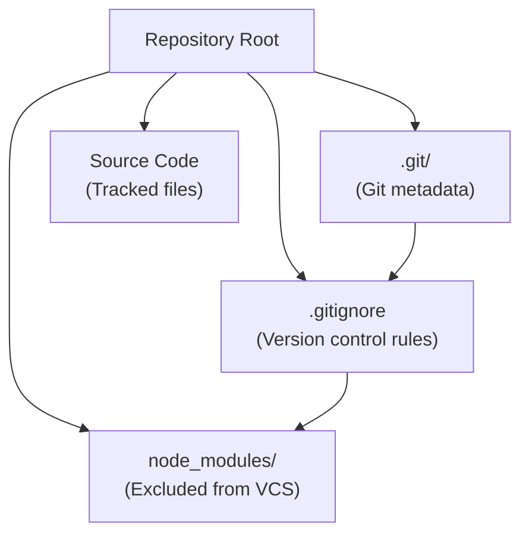
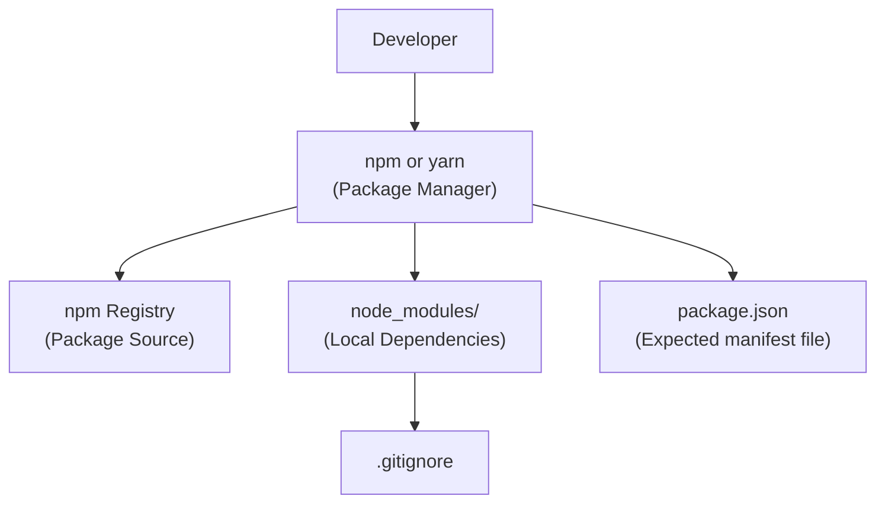
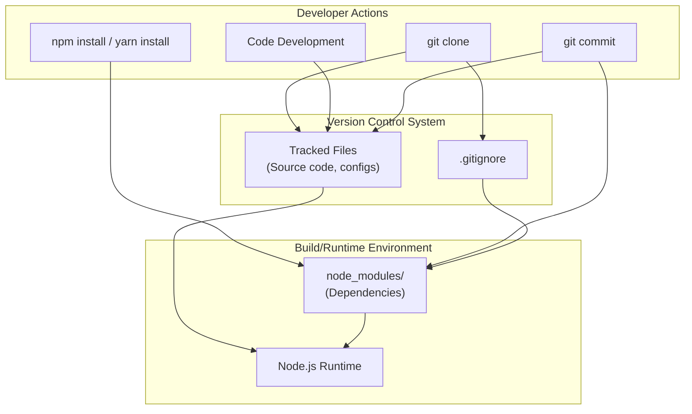
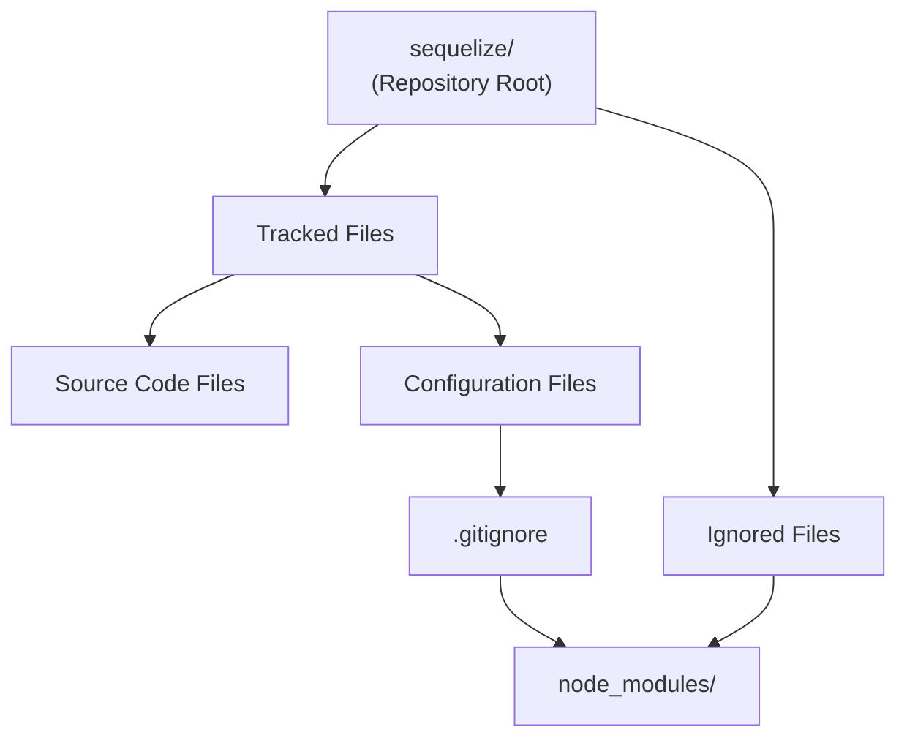

# Development Environment

> **Relevant source files**
> * [.gitignore](https://github.com/moichuelo/sequelize/blob/fd9c4bbb/.gitignore)

## Purpose and Scope

This document describes the development environment setup and configuration for the Sequelize codebase. It covers the version control system, dependency management practices, and the general development workflow based on the repository's configuration files.

For detailed information about specific version control configuration patterns, see [Version Control Configuration](/version-control-configuration/).

**Note**: Documentation is based on currently available configuration data from the repository. The primary source is the version control configuration file.

## Overview

The Sequelize repository follows standard Node.js project conventions for managing development environments. The configuration indicates a Git-based version control workflow with npm/yarn for dependency management.

### Development Environment Components

The following table summarizes the key components of the development environment:

| Component | Technology | Evidence |
| --- | --- | --- |
| Version Control | Git | [.gitignore L1](https://github.com/moichuelo/sequelize/blob/fd9c4bbb/.gitignore#L1-L1) |
| Package Management | npm or yarn | Implied by `node_modules` exclusion in [.gitignore L1](https://github.com/moichuelo/sequelize/blob/fd9c4bbb/.gitignore#L1-L1) |
| Runtime | Node.js | Implied by `node_modules` directory pattern |
| Dependency Storage | `node_modules/` | [.gitignore L1](https://github.com/moichuelo/sequelize/blob/fd9c4bbb/.gitignore#L1-L1) |

Sources: [.gitignore L1](https://github.com/moichuelo/sequelize/blob/fd9c4bbb/.gitignore#L1-L1)

## Version Control Configuration

The repository uses Git for version control. The `.gitignore` file defines which files and directories should be excluded from version tracking.

### Repository Structure



**Figure 1**: Repository file structure showing relationship between Git configuration and excluded directories

Sources: [.gitignore L1](https://github.com/moichuelo/sequelize/blob/fd9c4bbb/.gitignore#L1-L1)

### Excluded Patterns

The version control configuration explicitly excludes the following from Git tracking:

* `node_modules` - Node.js dependency directory

This exclusion is standard practice in Node.js projects, as dependencies can be reconstructed from package manifest files and should not be committed to version control.

For comprehensive details on version control patterns, see [Version Control Configuration](/version-control-configuration/).

Sources: [.gitignore L1](https://github.com/moichuelo/sequelize/blob/fd9c4bbb/.gitignore#L1-L1)

## Dependency Management

### Node.js Package Ecosystem

The presence of `node_modules` in the `.gitignore` file indicates that the project uses the Node.js package management ecosystem. Dependencies are installed into the `node_modules/` directory and excluded from version control.



**Figure 2**: Dependency management workflow showing how package managers interact with the `node_modules/` directory

Sources: [.gitignore L1](https://github.com/moichuelo/sequelize/blob/fd9c4bbb/.gitignore#L1-L1)

### Installation Workflow

The typical dependency installation process follows this pattern:

1. Developer clones the repository (version-controlled files only)
2. Developer runs package manager installation command
3. Package manager reads project manifest
4. Dependencies are downloaded and installed to `node_modules/`
5. `node_modules/` directory remains untracked per `.gitignore` rules

Sources: [.gitignore L1](https://github.com/moichuelo/sequelize/blob/fd9c4bbb/.gitignore#L1-L1)

## Development Workflow Integration

### Git Workflow Context



**Figure 3**: Development workflow showing the relationship between version-controlled files, ignored dependencies, and developer actions

Sources: [.gitignore L1](https://github.com/moichuelo/sequelize/blob/fd9c4bbb/.gitignore#L1-L1)

### File Categories

Based on the version control configuration, files in the repository fall into these categories:

| Category | Examples | Version Controlled | Source |
| --- | --- | --- | --- |
| Ignored Dependencies | `node_modules/` | No | [.gitignore L1](https://github.com/moichuelo/sequelize/blob/fd9c4bbb/.gitignore#L1-L1) |
| Source Code | `.js`, `.ts` files (expected) | Yes | Implicit from standard practice |
| Configuration | `.gitignore` | Yes | Present in repository |
| Build Artifacts | (not specified) | Unknown | No data available |

Sources: [.gitignore L1](https://github.com/moichuelo/sequelize/blob/fd9c4bbb/.gitignore#L1-L1)

## Environment Setup Process

### Initial Setup Steps

For a new developer setting up the Sequelize development environment, the expected process is:

1. **Clone Repository**: Obtain version-controlled source files ``` git clone https://github.com/moichuelo/sequelize ```
2. **Install Dependencies**: Populate `node_modules/` directory * The package manager will create the `node_modules/` directory * This directory will be automatically ignored by Git per [.gitignore L1](https://github.com/moichuelo/sequelize/blob/fd9c4bbb/.gitignore#L1-L1)
3. **Verify Environment**: Ensure all dependencies are correctly installed

Sources: [.gitignore L1](https://github.com/moichuelo/sequelize/blob/fd9c4bbb/.gitignore#L1-L1)

### File System State

After initial setup, the repository directory structure will include both tracked and ignored files:



**Figure 4**: File system hierarchy showing separation of tracked configuration files from ignored dependency directories

Sources: [.gitignore L1](https://github.com/moichuelo/sequelize/blob/fd9c4bbb/.gitignore#L1-L1)

## Configuration Files

### Available Configuration Data

The following configuration files are documented based on available data:

| File | Purpose | Location |
| --- | --- | --- |
| `.gitignore` | Defines version control exclusions | Repository root |

The `.gitignore` file contains exclusion patterns that prevent specific files and directories from being tracked by Git. Currently documented pattern: `node_modules` at [.gitignore L1](https://github.com/moichuelo/sequelize/blob/fd9c4bbb/.gitignore#L1-L1)

Sources: [.gitignore L1](https://github.com/moichuelo/sequelize/blob/fd9c4bbb/.gitignore#L1-L1)

## Summary

The Sequelize development environment is configured as a standard Node.js project with Git version control. The `.gitignore` configuration ensures that dependency directories are excluded from version control, following Node.js ecosystem best practices. Developers set up their environment by cloning the repository and installing dependencies through a package manager, which creates the excluded `node_modules/` directory locally.

Sources: [.gitignore L1](https://github.com/moichuelo/sequelize/blob/fd9c4bbb/.gitignore#L1-L1)