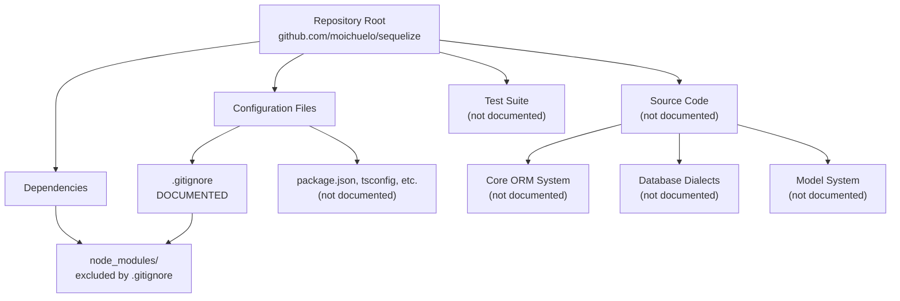
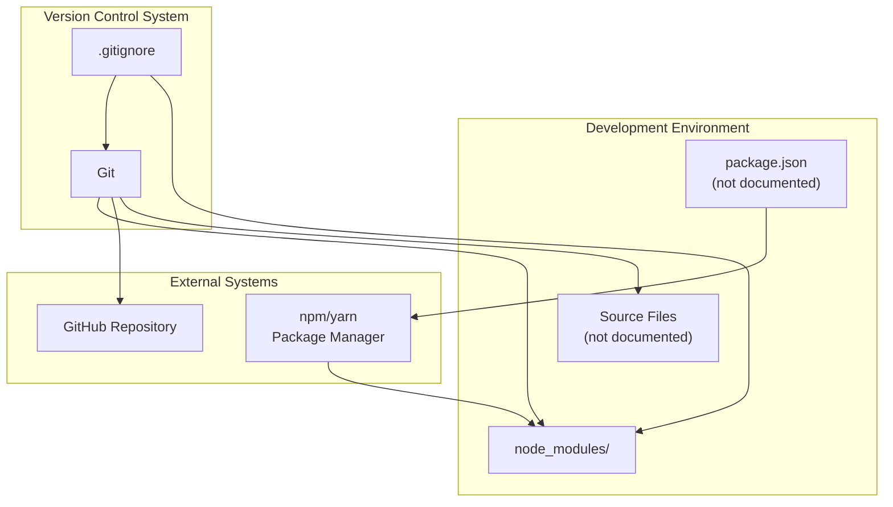
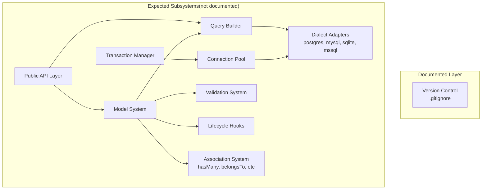

# Overview

> **Relevant source files**
> * [.gitignore](https://github.com/moichuelo/sequelize/blob/fd9c4bbb/.gitignore)

## Purpose and Scope

This document provides a high-level introduction to the Sequelize repository documentation. Sequelize is a promise-based Node.js ORM (Object-Relational Mapping) library that provides an abstraction layer for interacting with SQL databases.

**Current Documentation Scope**: Based on available cluster analysis data, this documentation currently covers only the development environment configuration aspects of the repository, specifically version control patterns. The core ORM functionality, including models, query builders, database dialects, and connection management systems, is not covered in this documentation set.

For detailed information about the Git version control configuration, see [Version Control Configuration](/version-control-configuration/).

Sources: [.gitignore L1](https://github.com/moichuelo/sequelize/blob/fd9c4bbb/.gitignore#L1-L1)

## Repository Structure Overview

The Sequelize repository at `https://github.com/moichuelo/sequelize` is a Node.js-based ORM project. The following diagram illustrates the documented components versus the expected full repository structure:

**Diagram: Repository Component Structure**

This diagram maps the repository organization, highlighting the single documented component (`.gitignore`) and its relationship to the Node.js dependency directory (`node_modules`).

Sources: [.gitignore L1](https://github.com/moichuelo/sequelize/blob/fd9c4bbb/.gitignore#L1-L1)

## Documentation Coverage

The current documentation scope is limited to development environment configuration. The following table summarizes what is and is not covered:

| Component Category | Documentation Status | Reference |
| --- | --- | --- |
| Version Control Configuration | **Documented** | [2.1](/version-control-configuration/) |
| Core ORM System | Not documented | - |
| Model Definitions | Not documented | - |
| Query Builder | Not documented | - |
| Database Dialects | Not documented | - |
| Connection Management | Not documented | - |
| Transaction System | Not documented | - |
| Association System | Not documented | - |
| Migration System | Not documented | - |
| Test Suite | Not documented | - |

Sources: [.gitignore L1](https://github.com/moichuelo/sequelize/blob/fd9c4bbb/.gitignore#L1-L1)

## Development Environment Context

The documented aspects of the repository relate to development environment setup, specifically how version control is configured to exclude dependency directories from the repository.

**Diagram: Development Environment and Version Control Integration**

This diagram shows how the `.gitignore` file integrates with Git version control and the Node.js dependency management workflow. The pattern `node_modules` defined in [.gitignore L1](https://github.com/moichuelo/sequelize/blob/fd9c4bbb/.gitignore#L1-L1)

 prevents the dependency directory from being tracked in version control.

Sources: [.gitignore L1](https://github.com/moichuelo/sequelize/blob/fd9c4bbb/.gitignore#L1-L1)

## Version Control Patterns

The repository uses Git for version control with specific exclusion patterns. Currently documented pattern:

| Pattern | Purpose | File Location |
| --- | --- | --- |
| `node_modules` | Excludes Node.js dependencies from version control | [.gitignore L1](https://github.com/moichuelo/sequelize/blob/fd9c4bbb/.gitignore#L1-L1) |

The `node_modules` directory contains third-party packages installed via npm or yarn and should not be committed to version control due to its large size and platform-specific binaries. Instead, dependencies are defined in `package.json` (not documented) and installed during the build process.

For complete details on version control configuration, see [Version Control Configuration](/version-control-configuration/).

Sources: [.gitignore L1](https://github.com/moichuelo/sequelize/blob/fd9c4bbb/.gitignore#L1-L1)

## Expected System Architecture

While not currently documented, a complete Sequelize ORM codebase typically contains the following major subsystems:

**Diagram: Expected ORM Architecture Components**

This diagram illustrates the typical architecture of an ORM system like Sequelize. None of these functional components are currently documented, with the exception of the version control infrastructure that supports the development workflow.

Sources: [.gitignore L1](https://github.com/moichuelo/sequelize/blob/fd9c4bbb/.gitignore#L1-L1)

## Documentation Hierarchy

This documentation set follows a hierarchical structure:

* **1. Overview** (this page) - High-level introduction and scope definition * **2. Development Environment** - Environment setup and configuration * **2.1. Version Control Configuration** - Detailed `.gitignore` patterns and Git workflow

Additional subsystems and components will require further cluster analysis data to document.

Sources: [.gitignore L1](https://github.com/moichuelo/sequelize/blob/fd9c4bbb/.gitignore#L1-L1)