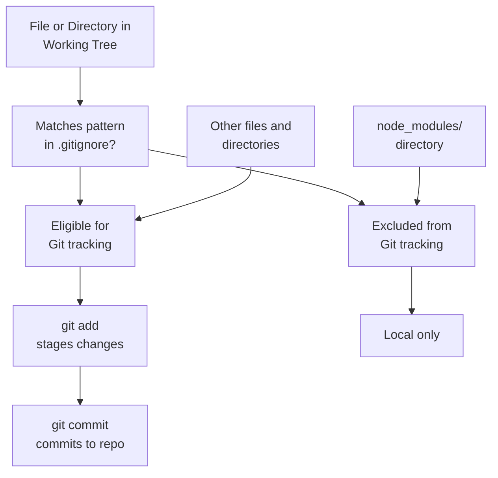
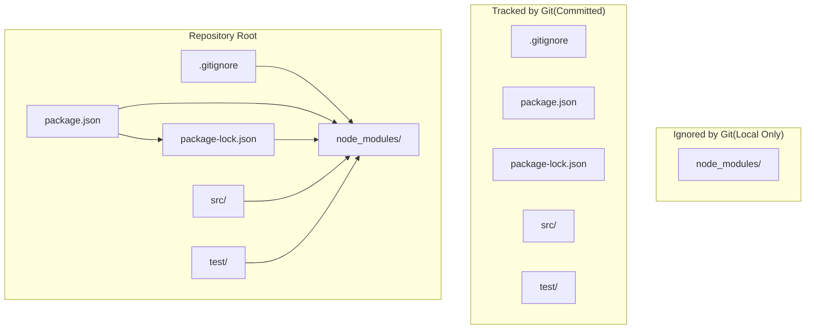
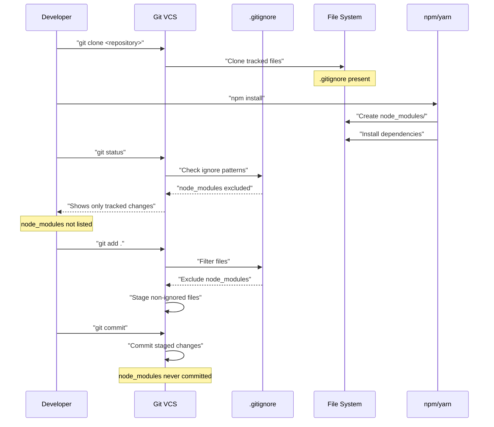

# Version Control Configuration

> **Relevant source files**
> * [.gitignore](https://github.com/moichuelo/sequelize/blob/fd9c4bbb/.gitignore)

## Purpose and Scope

This document details the Git version control configuration for the Sequelize repository, specifically the patterns defined in the `.gitignore` file that control which files and directories are excluded from version control tracking. This configuration determines what gets committed to the repository and what remains local-only in developer workspaces.

For information about the broader development environment setup, see [Development Environment](/development-environment/).

Sources: [.gitignore L1](https://github.com/moichuelo/sequelize/blob/fd9c4bbb/.gitignore#L1-L1)

## Configuration File Location

The version control configuration is defined in a single file at the repository root:

| File | Purpose | Location |
| --- | --- | --- |
| `.gitignore` | Defines patterns for files and directories to exclude from Git tracking | Repository root |

Sources: [.gitignore L1](https://github.com/moichuelo/sequelize/blob/fd9c4bbb/.gitignore#L1-L1)

## Ignore Patterns

The repository's `.gitignore` file contains the following exclusion pattern:

```
node_modules
```

This pattern instructs Git to ignore the `node_modules` directory and all its contents throughout the repository.

Sources: [.gitignore L1](https://github.com/moichuelo/sequelize/blob/fd9c4bbb/.gitignore#L1-L1)

### node_modules Directory Exclusion

The `node_modules` directory is the standard location where npm (Node Package Manager) and yarn install all project dependencies. This directory is excluded from version control for several technical reasons:

**Size and Volume**: Node.js projects typically have hundreds or thousands of dependency packages, resulting in tens of thousands of files. Including these in version control would significantly increase repository size and clone times.

**Reproducibility**: Dependencies are explicitly declared in `package.json` and locked to specific versions in `package-lock.json` or `yarn.lock`. Any developer can reproduce the exact dependency tree by running `npm install` or `yarn install`.

**Platform-Specific Binaries**: Some npm packages include native compiled binaries that are platform-specific (Windows, macOS, Linux). Committing these would cause conflicts across development environments.

**Frequent Changes**: Dependency updates are common, and including `node_modules` would create massive, noisy diffs that obscure actual code changes.

Sources: [.gitignore L1](https://github.com/moichuelo/sequelize/blob/fd9c4bbb/.gitignore#L1-L1)

## Git Ignore Processing Flow

The following diagram illustrates how Git processes files in the repository in relation to the `.gitignore` configuration:

**Diagram: Git File Processing with .gitignore**



**Process Description**:

1. When Git scans the working tree, it evaluates each file and directory against patterns in `.gitignore`
2. The pattern `node_modules` matches any file or directory with that exact name at any level
3. Matched items are automatically excluded from Git's tracking system
4. Developers cannot accidentally add ignored files using `git add` (unless using force flag)
5. Only non-ignored files proceed through the staging and commit workflow

Sources: [.gitignore L1](https://github.com/moichuelo/sequelize/blob/fd9c4bbb/.gitignore#L1-L1)

## Repository Structure and Ignore Relationships

This diagram shows the relationship between the `.gitignore` file, the directories it affects, and the dependency management system:

**Diagram: Repository Structure with Version Control Exclusions**



**Structure Explanation**:

* `.gitignore` at repository root controls exclusion patterns for entire repository
* `node_modules` directory is populated by package managers but never committed
* Dependency declarations (`package.json`) and lock files are tracked to enable reproduction
* Source and test code import from `node_modules` which exists locally but not in repository

Sources: [.gitignore L1](https://github.com/moichuelo/sequelize/blob/fd9c4bbb/.gitignore#L1-L1)

## Pattern Matching Behavior

The ignore pattern `node_modules` exhibits the following matching behavior:

| Pattern | Matches | Scope |
| --- | --- | --- |
| `node_modules` | `node_modules/` at repository root | Any directory level |
| `node_modules` | `packages/lib/node_modules/` (nested) | Any directory level |
| `node_modules` | `node_modules` (if file existed) | Files and directories |

**Pattern Characteristics**:

* **No leading slash**: Matches at any directory level, not just repository root
* **No trailing slash**: Matches both files and directories (though typically directory)
* **No wildcards**: Exact name match only, not partial matches
* **Recursive**: Applies to all subdirectories within the repository

Sources: [.gitignore L1](https://github.com/moichuelo/sequelize/blob/fd9c4bbb/.gitignore#L1-L1)

## Integration with Development Workflow

The version control configuration integrates with the standard Node.js development workflow:

**Diagram: Developer Workflow with Version Control**



**Workflow Steps**:

1. **Clone**: Developer clones repository, receives `.gitignore` but not `node_modules`
2. **Install**: Developer runs `npm install` to populate `node_modules` locally
3. **Status Check**: `git status` respects `.gitignore` and does not list `node_modules` as untracked
4. **Stage**: `git add` operations automatically exclude ignored patterns
5. **Commit**: Changes are committed without dependency artifacts

Sources: [.gitignore L1](https://github.com/moichuelo/sequelize/blob/fd9c4bbb/.gitignore#L1-L1)

## Pattern Scope and Limitations

The current `.gitignore` configuration contains only the essential `node_modules` exclusion.

**What is Excluded**:

* `node_modules/` directory at any level
* All contents within `node_modules/` directories

**What is Not Excluded** (common patterns absent from current configuration):

* Build output directories (`dist/`, `build/`, `lib/`)
* Environment files (`.env`, `.env.local`, `.env.*.local`)
* IDE/editor files (`.vscode/`, `.idea/`, `*.swp`, `*.sublime-*`)
* OS-specific files (`.DS_Store`, `Thumbs.db`, `desktop.ini`)
* Log files (`*.log`, `npm-debug.log*`, `yarn-debug.log*`)
* Coverage reports (`coverage/`, `.nyc_output/`)
* Temporary files (`tmp/`, `temp/`, `.cache/`)

The minimal configuration suggests that additional exclusions may be handled through global Git ignore configuration (`~/.gitignore_global`) or are not yet needed for the project.

Sources: [.gitignore L1](https://github.com/moichuelo/sequelize/blob/fd9c4bbb/.gitignore#L1-L1)

## File-Level Technical Details

**File Properties**:

| Property | Value |
| --- | --- |
| File encoding | ASCII/UTF-8 plain text |
| Line ending style | Unix (LF) |
| Number of patterns | 1 |
| Number of comments | 0 |
| Negation patterns | 0 |

**Pattern Processing Order**: Git processes `.gitignore` patterns sequentially from top to bottom. With only one pattern, processing order is not a factor in this configuration.

**Comment Lines**: The file contains no comment lines (which would begin with `#`). This is typical for minimal configurations.

**Negation Patterns**: The file contains no negation patterns (which would begin with `!` to un-ignore previously ignored paths).

Sources: [.gitignore L1](https://github.com/moichuelo/sequelize/blob/fd9c4bbb/.gitignore#L1-L1)

## Verification and Troubleshooting

Developers can verify the `.gitignore` configuration using Git commands:

**Check if specific path is ignored**:

```
git check-ignore -v node_modules
```

Expected output: `.gitignore:1:node_modules    node_modules`

**Check with verbose output**:

```
git check-ignore -v node_modules/package-name
```

Expected output: `.gitignore:1:node_modules    node_modules/package-name`

**List all ignored files in working tree**:

```
git status --ignored
```

**View ignored files in a directory**:

```
git ls-files --others --ignored --exclude-standard
```

**Force add ignored file** (not recommended):

```
git add -f node_modules/some-file.js
```

These commands allow developers to confirm that the `node_modules` pattern functions as intended and troubleshoot unexpected behavior.

Sources: [.gitignore L1](https://github.com/moichuelo/sequelize/blob/fd9c4bbb/.gitignore#L1-L1)

## Pattern Application Scope

The `.gitignore` file at the repository root applies to the entire repository tree. Git also supports `.gitignore` files in subdirectories, which would apply only to that subdirectory and its descendants. The current configuration has no subdirectory-specific ignore files, meaning the single `node_modules` pattern controls exclusions repository-wide.

**Inheritance Hierarchy**:

1. Repository root `.gitignore` (this file) - applies to all paths
2. Subdirectory `.gitignore` files - not present in current configuration
3. Global `.gitignore` configuration - per-user, outside repository scope

Sources: [.gitignore L1](https://github.com/moichuelo/sequelize/blob/fd9c4bbb/.gitignore#L1-L1)